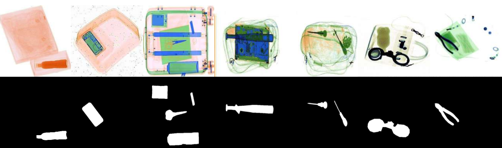

<h1 align="center"><b>XSeg: A Large-scale X-ray Contraband Segmentation Benchmark For Real-World Security Screening</b></h1>

---



---

## Contents
* [Dataset](#1-dataset)
* [Setup](#2-setup)

---

## 1. Dataset
Due to various protocol restrictions and security controls, if you need the data source files, please contact the author at the author's email address and we will respond and send the data source files within a few business days. We will disclose the author's e-mail address after the paper has been accepted.

We will post the download link after the paper has been accepted!

## Additional version
We provide researchers with a fine-grained categorized version of the semantic segmentation of Xseg, a total of 32 categories of common contraband, the figure shows only part of the data example, called Xseg-semangtic, if you need it, you can contact the author to get it.<br>


## DATA Pipeline
We provide a reasonable pipeline for contraband dataset construction to build high-quality datasets and design a model Adaptive Point SAM (APSAM) specifically for contraband segmentation annotation task. APSAM is user-friendly enough and has superior segmentation performance.


---

## 2. Setup
Our development is based on the SAMUS source code, thanks to the contribution of the SAMUS repository!

## Getting Start
```python
conda create -n apsam python=3.9
conda activate apsam
pip install -r requirements.txt
```

## Starting Checkpoint

[sam-vit-b](https://github.com/facebookresearch/segment-anything)

We make apsam's checkpoint public after the paper has been accepted!

## Training
```python
python train.py --modelname APSAM
```

---


---

## To-Do List
* [√] Making XSeg public
* [√] Provide training and testing code for APSAM.
* [×] Checkpoints for APSAM will be made public.
